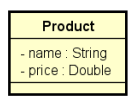

# Problema

• Suponha uma classe Product com os atributos name e price.
• Podemos implementar a comparação de produtos por meio da
implementação da interface Comparable<Product>
• Entretanto, desta forma nossa classe não fica fechada para
alteração: se o critério de comparação mudar, precisaremos
alterar a classe Product.
• Podemos então usar o default method "sort" da interface List:
default void sort(Comparator<? super E> c)

## Comparator objeto de classe separada

* Classe **Program**: Esta classe contém o método main, que é o ponto de entrada do programa. 
Aqui, uma lista de produtos é criada, produtos são adicionados a essa lista e, em seguida, a lista é ordenada utilizando um comparador.

* Classe **Product**: Representa um produto, contendo dois atributos: name (nome do produto) e price (preço do produto). 
Inclui construtores, métodos para acessar (getters) e modificar (setters) os atributos, e um método toString para facilitar a visualização dos produtos.

* Classe **MyComparator**: Implementa a interface Comparator<Product>, permitindo a comparação de objetos da classe Product. 
O método compare define a lógica para comparar dois produtos com base nos seus nomes, convertendo-os para maiúsculas para garantir 
que a comparação não seja sensível a maiúsculas/minúsculas.

### Solução Usando Comparator

* Flexibilidade: Ao usar um objeto Comparator separado, a classe Product não precisa ser alterada se o critério de comparação 
mudar (por exemplo, se quisermos comparar produtos pelo preço em vez do nome). Isso segue o princípio de design aberto/fechado,
onde a classe é aberta para extensão (novos comparadores) mas fechada para modificação.
* Uso do Método sort: O método sort da lista permite ordenar os produtos de maneira flexível, utilizando diferentes implementações de Comparator.

## Comparator objeto de classe anônima

* Classe **Program**: Esta classe contém o método main, que é o ponto de entrada do programa.
Aqui, é criada uma lista de produtos, produtos são adicionados a essa lista e a lista é ordenada utilizando um comparador definido como uma classe anônima.

* Lista de Produtos:
  * Uma instância de ArrayList<Product> é criada para armazenar os produtos. 
  * Produtos como "TV", "Notebook" e "Tablet" são adicionados à lista, cada um com seu respectivo preço.

* Classe Anônima para Comparator:
    * Um objeto Comparator<Product> é criado usando uma classe anônima. Isso significa que a implementação do comparador 
é definida na própria declaração do objeto, sem a necessidade de criar uma nova classe separada. 
    * O método compare é sobrescrito para definir a lógica de comparação, que aqui compara os nomes dos produtos convertidos para maiúsculas. 
Isso garante que a comparação não seja sensível a maiúsculas/minúsculas.

* Ordenação da Lista:
  * A lista é ordenada utilizando o método sort, passando o comparador (comp) como argumento. Isso aplica a lógica de comparação definida na classe anônima.

* Impressão dos Produtos:
    * Após a ordenação, um loop for é utilizado para imprimir cada produto na lista, garantindo que eles estejam exibidos 
na ordem correta, conforme definido pela lógica do comparador.

### Vantagens de Usar Classes Anônimas
* Conveniente: Classes anônimas são úteis para criar implementações rápidas de interfaces ou classes abstratas que não 
precisam ser reutilizadas em outros lugares, tornando o código mais conciso.

* Escopo Local: O comparador é definido dentro do método main, o que significa que ele é local ao método e não polui o escopo global da classe Program.

## Comparator objeto de expressão lambda com chaves

* Classe **Program**: Esta classe contém o método main, que é o ponto de entrada do programa. Aqui, uma lista de produtos
é criada, produtos são adicionados a essa lista e a lista é ordenada utilizando um comparador definido como uma expressão lambda.

* Lista de Produtos:
  * Uma instância de ArrayList<Product> é criada para armazenar os produtos.
  * Produtos como "TV", "Notebook" e "Tablet" são adicionados à lista, cada um com seu respectivo preço.

* Expressão Lambda para Comparator:
  * Um objeto Comparator<Product> é criado utilizando uma expressão lambda, que é uma forma concisa de implementar interfaces funcionais.
  * A expressão lambda (p1, p2) -> { ... } define a lógica de comparação entre dois produtos (p1 e p2). As chaves são usadas
para delimitar o corpo da expressão, permitindo que múltiplas linhas de código sejam incluídas se necessário.
  * O método compare compara os nomes dos produtos, utilizando toUpperCase() para garantir que a comparação não seja sensível a maiúsculas/minúsculas.

* Ordenação da Lista:
  * A lista é ordenada utilizando o método sort, passando o comparador (comp) como argumento. Isso aplica a lógica de comparação definida na expressão lambda.

* Impressão dos Produtos:
  * Após a ordenação, um loop for é utilizado para imprimir cada produto na lista, garantindo que eles estejam exibidos na ordem correta, conforme definido pela lógica do comparador.

### Vantagens de Usar Expressões Lambda
* Sintaxe Concisa: As expressões lambda permitem uma sintaxe mais curta e mais legível ao implementar interfaces funcionais, 
como Comparator, sem a necessidade de criar classes anônimas.
* Foco na Lógica: Ao usar uma expressão lambda, o foco é diretamente na lógica de comparação, tornando o código mais claro e fácil de entender.
* Flexibilidade: As expressões lambda podem ser usadas em qualquer lugar que uma interface funcional seja esperada,
proporcionando flexibilidade na implementação de comportamentos.

## Comparator objeto de expressão lambda sem chaves

## Comparator expressão lambda "direto no argumento"